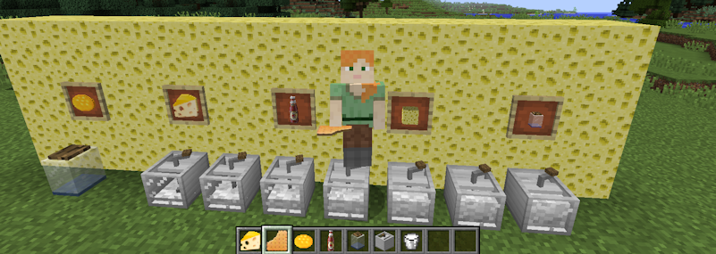
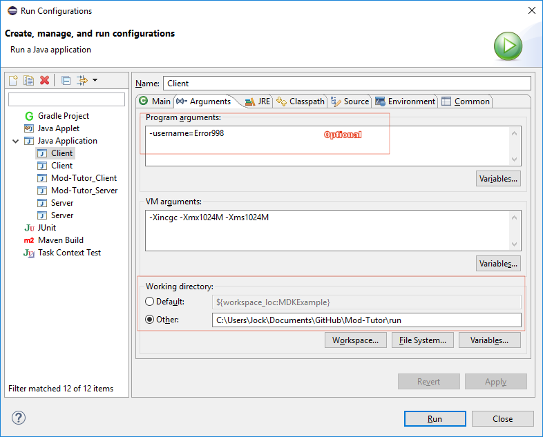

# Error_998's Mod Tutorial  

  
A tutorial mod for keeping track of all the things I have learnt in Minecraft modding so far. This mod has no purpose or goal other than being an educational tool for myself.

## Getting Started

These instructions will get you a copy of the project up and running on your local machine for development and testing purposes.

### Prerequisities

1. Correct Forge MDK for the Minecraft version you want to compile  
-- Download [ForgeMDK](http://files.minecraftforge.net/)


2. Java IDE, Eclipse will be used in this example but your welcome to use IntelliJ instead  
-- Download and install [Eclipse](https://eclipse.org/downloads)

### Installing

**Step 1)**
```
Extract the ForgeMDK zip file and enter the folder.
```

**Step 2)**

```
Delete the src folder
```

**Step 3)**

```
Clone and download this repository extrating it in the same folder as above.
```
**Step 4)**

```
Run Setup Workspace.bat
```

### Setup Eclipse Workspace

**Step 1)**

```
Run Eclipse and open the project located in the above eclipse folder
```

**Step 2)**

```
Open the Run Configuration dialogbox under the Run menu
```

**Step 3)**

```
Open the '(x)= Arguments' tab
```
**Step 4)**

```
Change the Working directory to were you extracted the project and open the run folder. 
```

### MrCrayfish's video tutorial

If you are having any issues with the above instructions cheeck out MrCrayfish's excellent mod tutorial on how to setup your workspace

<a href="http://www.youtube.com/watch?feature=player_embedded&v=jFBuf_aGmec
" target="_blank"></a>

### Alternative IntelliJ setup

If you would rather prefer to use IntelliJ follow CPW's video tutorial

<a href="http://www.youtube.com/watch?feature=player_embedded&v=PfmlNiHonV0
" target="_blank"></a>

## Authors

* **[Error998](https://github.com/error998)** - *Project Owner*

See also the list of [contributors](https://github.com/Error998/Mod-Tutor/graphs/contributors) who participated in this project.

## License

Copyright © 2016 Error_998 <support@saminecraft.co.za>  

This work is free. You can redistribute it and/or modify it under the
terms of the Do What The Fuck You Want To Public License, Version 2,
as published by Sam Hocevar.  

See the [LICENSE.md](LICENSE.md) file or visit
http://www.wtfpl.net/ for more details.

## Acknowledgments

[ MrCrayfish](https://github.com/MrCrayfish) for his excellent video [mod tutorials](https://mrcrayfish.com/)  


[ McJty](https://github.com/McJty) for his excellent [github tutorials](http://modwiki.temporal-reality.com/mw/index.php/Main_Page)


[ TheGreyGhost](https://github.com/TheGreyGhost) for his excellent MinecraftByExample [github tutorials](https://github.com/TheGreyGhost/MinecraftByExample)